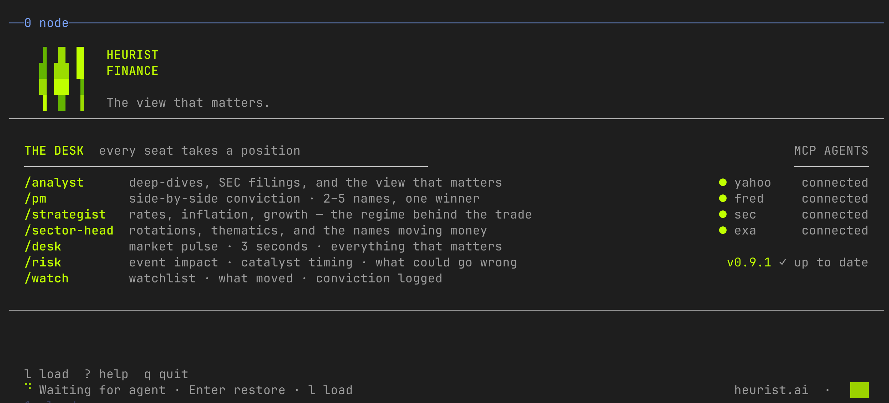
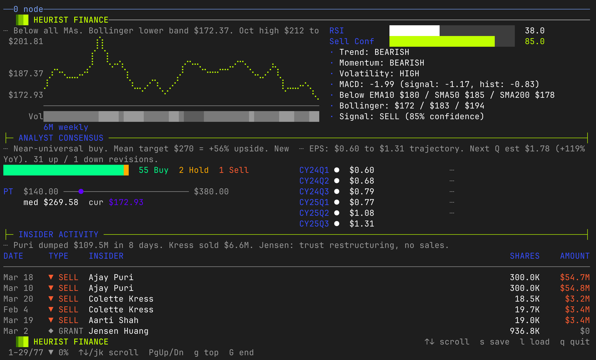
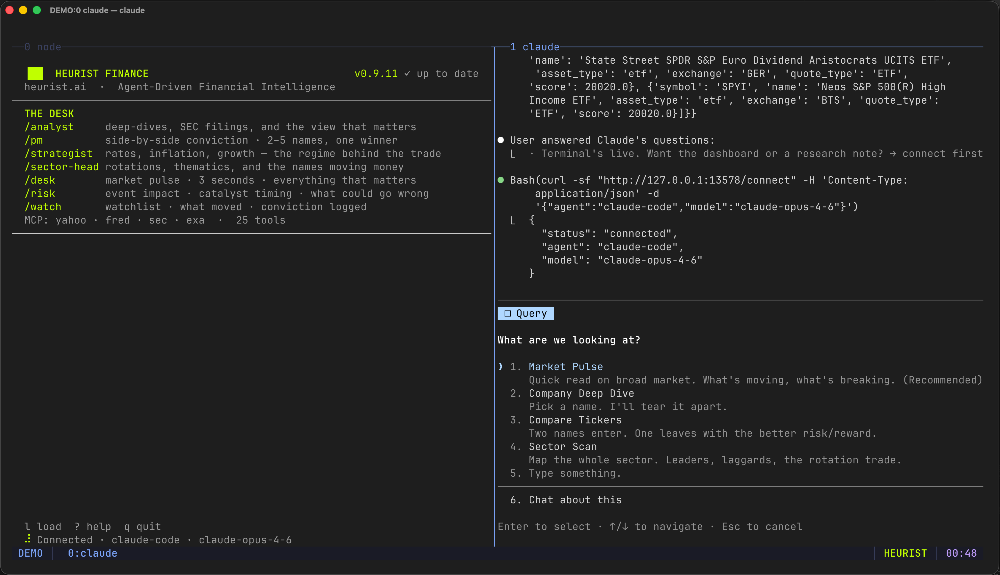

<h1 align="center">Heurist Finance</h1>

<p align="center">
  <strong>The view that matters.</strong><br>
  Agent-native financial research for your terminal.
</p>

<p align="center">
  
  
  
</p>

<p align="center">
  
</p>

---

Ask about any stock, sector, or macro regime. Get a thesis — not a summary.
AI analysts with sell-side conviction, powered by real-time MCP tools across
Yahoo Finance, FRED, SEC EDGAR, and Exa Search. Runs in your terminal or
inline as a research note.

No Bloomberg terminal. No $25K/year. No API keys to manage. Just install and ask.

<p align="center">
  
</p>

## The Desk

Every seat takes a position.

| Analyst | Role | What they do |
|---------|------|-------------|
| `/analyst` | Senior Equity Analyst | Deep-dives, SEC filings, and the view that matters |
| `/pm` | Portfolio Manager | Side-by-side conviction. 2–5 names, one winner. |
| `/strategist` | Chief Macro Strategist | Rates, inflation, growth — the regime behind the trade |
| `/sector-head` | Sector Head | Rotations, thematics, and the names moving money |
| `/desk` | Trading Desk | Market pulse. 3 seconds. Everything that matters. |
| `/risk` | Risk Analyst | Event impact. Catalyst timing. What could go wrong. |
| `/watch` | Watchlist Monitor | Your names. Tracked. Alerted. Conviction logged. |

## Quick Start

**Requirements:** Node.js 18+

```bash
# 1. Install
npx @heurist-network/skills add finance

# 2. Setup (detects your agent, asks before writing config)
cd ~/.agents/skills/heurist-finance && bash setup.sh

# 3. Start the terminal
hf
```

Then in your agent session:

```
/heurist-finance NVDA
```

The skill detects your terminal, connects, and asks how you want the output:

<p align="center">
  
</p>

Pick **Terminal** for the live dashboard, or **Research** for a dense note
right in conversation. Same depth, different canvas.

## Why This Exists

Finance chatbots give you prose. Broker apps give you data. Neither gives you
a **desk** — thesis, evidence, regime framing, risk, and verdict in one artifact.

Bloomberg has this. It costs $25K/year and doesn't talk to your agent.

Heurist Finance is the first research desk built for agents. It installs into
Claude Code, Codex CLI, OpenCode, or any MCP host. It runs locally. Every panel,
chart, and verdict is inspectable and deterministic — not hallucinated summaries,
but schema-validated renders from real data sources.

The MCP tools aren't the product. The **workflow compression** is: go from
question to conviction note without API-key plumbing, source juggling, or
hand-written analyst memos.

## How It Works

```
  You                  Heurist Finance               Heurist Mesh
  ┌─────┐              ┌──────────────┐              ┌──────────┐
  │     │──question───▶│  routes to   │──MCP tools──▶│ Yahoo    │
  │     │              │  sub-skill   │  in parallel │ FRED     │
  │     │◀─dashboard───│  forms thesis│◀─real data───│ SEC      │
  │     │◀─verdict─────│  renders TUI │              │ Exa      │
  └─────┘              └──────────────┘              └──────────┘
```

1. You ask a financial question
2. The skill routes to the right analyst
3. Analyst fetches data via Heurist Mesh MCP tools — **in parallel**
4. Forms a thesis. Self-critiques: "Is this genuine insight or obvious summary?"
5. Renders progressively — blocks appear as data arrives
6. Offers follow-up drills in character

Session memory persists — the desk remembers prior reports and conviction changes.

## Terminal

```bash
hf
```

Full-screen terminal with branded splash. When your agent runs a query,
it renders a live dashboard with progressive block rendering.

| Key | Action |
|-----|--------|
| `j`/`k` or `↑`/`↓` | Scroll |
| `PgUp`/`PgDn` | Page jump |
| `g`/`G` | Top / bottom |
| `Tab` | Next panel |
| `?` | Help overlay |
| `q` | Return to splash / quit |

Mouse wheel works. Multiple themes available.

## Data Sources

All data fetched in real-time via MCP. No API keys required — Heurist Mesh
handles the connections.

| Source | What you get |
|--------|-------------|
| **Yahoo Finance** | Quotes, price history, technicals, analyst consensus, fundamentals, news |
| **FRED** | CPI, PCE, Fed Funds, GDP, unemployment, macro regime context |
| **SEC EDGAR** | Filings, XBRL financials, insider activity, institutional holders, activist watch |
| **Exa Search** | Web search with LLM digest, URL scraping for deep context |

## Community

Built by [Heurist AI](https://heurist.ai) as a [Heurist Mesh](https://mesh.heurist.ai) marketplace skill.

- Issues and feedback: [GitHub Issues](https://github.com/heurist-network/heurist-finance/issues)
- Heurist community: [Discord](https://discord.gg/heuristai)

## License

MIT — see [LICENSE](LICENSE).
